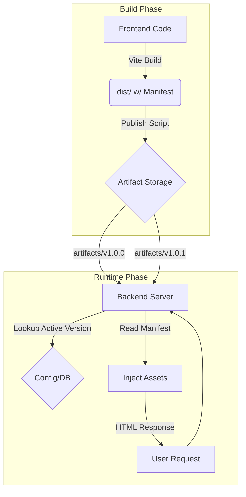

# Frontend Version Control Proof-of-Concept

A full-stack demonstration of handling frontend versioning via backend-side injection and immutable artifacts. This project implements a "Micro-Frontend" style delivery mechanism where the backend controls exactly which version of the frontend is served to the user, enabling instant rollbacks, A/B testing, and canary releases without frontend re-deployments.

## 🚀 Key Features

- **Immutable Artifacts**: Every build is versioned (e.g., `v1.0.0`) and stored permanently.
- **Backend-Driven Injection**: The backend dynamically injects the correct `<script>` and `<link>` tags into the HTML shell based on the active version.
- **Manifest-Based Loading**: Uses Vite's `manifest.json` to resolve hashed filenames (e.g., `index.a1b2c.js`) at runtime.
- **Instant Rollback**: Switch versions in milliseconds via a simple API call, zero downtime.
- **Separation of Concerns**: Frontend focuses on "Build", Backend focuses on "Distribution".

## 🏗 Architecture



### directory Structure

```text
.
├── apps/
│   ├── frontend/       # Vite + React application
│   └── backend/        # Express server for serving HTML & Assets
├── artifacts/          # Storage for build outputs (v1.0.0, v1.0.1...)
├── scripts/            # Release engineering scripts (publish.ts)
└── README.md
```

## 🛠 Quick Start

### Prerequisites

- Node.js 20+
- pnpm

### 1. Setup

Install all dependencies in the workspace:

```bash
pnpm install
```

### 2. Publish Versions (Simulate Releases)

We will build the frontend twice to simulate two distinct versions.

**Publish v1.0.0:**
```bash
cd apps/frontend
pnpm publish:v1
# Output: Artifacts stored in ../../artifacts/v1.0.0
```

**Publish v1.0.1 (Newer version):**
```bash
pnpm publish:v2
# Output: Artifacts stored in ../../artifacts/v1.0.1
```

### 3. Run the Backend

Start the server which serves the frontend application:

```bash
cd apps/backend
pnpm build
pnpm start
```

Visit **http://localhost:3000**. You should see the application running. By default, it might load the latest or a default version.

### 4. Dynamic Version Switching

You can switch the live version instantly using the Admin API.

**Switch to v1.0.1:**
```bash
curl -X POST http://localhost:3000/api/admin/version \
  -H "Content-Type: application/json" \
  -d '{"version": "v1.0.1"}'
```
Refresh the browser. The content should update.

**Rollback to v1.0.0:**
```bash
curl -X POST http://localhost:3000/api/admin/version \
  -H "Content-Type: application/json" \
  -d '{"version": "v1.0.0"}'
```
Refresh again. You are back on the old version!

## 🧩 Technical Details

### The `manifest.json` Magic
Vite builds generate files with hashes (e.g., `index.2f3d1.js`) for caching. The backend cannot guess these names.
Instead, we read the `manifest.json` generated by Vite:

```json
{
  "index.html": {
    "file": "assets/index.2f3d1.js",
    "css": ["assets/index.9a8b7.css"]
  }
}
```

The backend reads this file for the *active version* and injects `src="/artifacts/v1.0.0/assets/index.2f3d1.js"` into the response.

### TypeScript Integration
We use a shared `vite-env.d.ts` in the frontend to ensure TypeScript understands Vite's specific import types (CSS modules, SVGs), ensuring a type-safe development experience.
