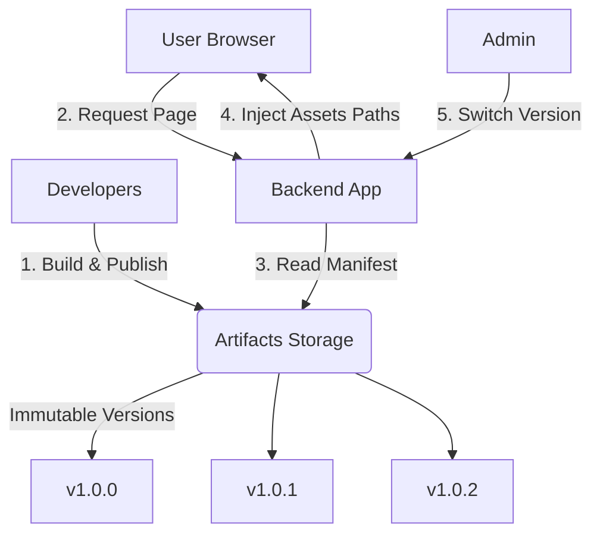

# 前端版本控制系统原理 (Frontend Version Control Principles)

本项目实现了一套基于 **Manifest 驱动** 和 **后端动态注入** 的前端版本控制系统。

## 1. 核心架构 (Core Architecture)

系统的核心理念是将“前端构建”与“前端发布”分离，并通过后端来控制“运行时版本”。



## 2. 前端构建与发布 (Build & Publish)

构建过程不仅仅是编译代码，还包括了 **版本化** 和 **不可变性校验**。

### 关键步骤 (`scripts/publish.ts`)

1.  **输入版本号**：开发者运行 `npm run publish:v1` (或 v2, v3...)，指定目标版本（如 `v1.0.3`）。
2.  **构建 (Vite Build)**：
    *   执行 `vite build --base=/artifacts/v1.0.3/`。
    *   **Public Base Path**：最关键的配置。它告诉 Vite 生成的 CSS/JS 引用全部带上这个版本前缀。
    *   **Manifest 生成**：Vite 生成 `dist/.vite/manifest.json`，这是后端识别入口文件的“地图”，记录了 `index.html` 对应哪个 hash 过的 JS/CSS 文件。
3.  **不可变性检查 (Immutability)**：
    *   脚本会检查 `artifacts/v1.0.3` 目录是否已存在。
    *   **规则**：如果存在，直接报错退出。**禁止覆盖已发布的版本**。这保证了生产环境的稳定性，回滚永远是安全的。
4.  **归档 (Archiving)**：
    *   将构建产物 (`dist`) 移动到 `artifacts/v1.0.3`。
    *   在真实场景中，这一步对应上传到 OSS (阿里云 OSS / AWS S3)。

### 产物结构
```text
artifacts/
  ├── v1.0.0/
  │    ├── .vite/manifest.json  <-- 核心映射文件
  │    ├── assets/index.xh82a.js
  │    └── ...
  ├── v1.0.1/
  └── ...
```

## 3. 后端运行与注入 (Runtime Serving & Injection)

后端不仅是 API 服务器，还是 **前端页面的渲染控制器**。

### 关键逻辑 (`apps/backend/src/app.ts`)

当用户访问根路径 `/` 时：

1.  **确定当前版本**：
    *   `versionService.getActiveVersion()` 获取当前激活的版本号（存储在内存或数据库中）。
2.  **读取 Manifest**：
    *   后端读取对应版本的 `manifest.json`。
    *   解析出该版本的 JS 入口文件（如 `index.a1b2c.js`）和 CSS 文件。
3.  **HTML 模板注入 (Server-Side Injection)**：
    *   读取 `views/index.html` 模板。这是一个不包含具体 `<script>` 或 `<link>` 标签的骨架。
    *   **动态替换**：
        *   `<!-- INJECT_STYLES -->` -> `<link href="/artifacts/v1.0.3/assets/index.css">`
        *   `<!-- INJECT_SCRIPTS -->` -> `<script src="/artifacts/v1.0.3/assets/index.js"></script>`
        *   `<!-- INJECT_VERSION -->` -> `v1.0.3` (注入全局变量供调试)
4.  **返回响应**：
    *   浏览器收到的是一个完整的、指向特定版本资源的 HTML。

## 4. 优势总结

1.  **秒级回滚**：
    *   回滚不需要重新构建，也不需要重新部署前端。
    *   只需调用 API 把“当前版本”指回 `v1.0.0`，下一个请求就会立即加载老版本的资源。
2.  **灰度发布能力 (基础)**：
    *   目前的架构很容易扩展出灰度发布。后端可以根据 User ID 决定给该用户注入 `v1.0.0` 还是 `v1.0.1` 的资源链接。
3.  **缓存友好**：
    *   每个版本的资源路径都不同 (`/artifacts/v1.0.0/...`)。
    *   浏览器可以对 JS/CSS 做永久缓存（Forever Cache），因为文件名带 Hash 且路径带版本，永远不会冲突。

## 5. 前端文件结构说明 (Frontend File Structure)

以下是 `apps/frontend` 目录中关键文件的作用说明：

### 配置文件

*   **`package.json`**:
    *   定义了项目的依赖（如 React, Vite）。
    *   **Scripts**: 定义了 `build`, `dev`, 以及最重要的 `publish:vX` 脚本。这些脚本是版本发布的入口。
*   **`vite.config.ts`**:
    *   Vite 的构建配置。
    *   关键配置 `base`: 在构建时动态传入，确保生成的资源路径包含版本号（如 `/artifacts/v1.0.3/`）。
    *   关键配置 `build.manifest`:启用 Manifest 生成，供后端使用。
*   **`tsconfig.app.json`**:
    *   前端应用代码（运行在浏览器端）的 TypeScript 配置。
    *   定义了路径别名、编译选项等。
*   **`tsconfig.node.json`**:
    *   运行在 Node.js 环境下的代码（如 `vite.config.ts`）的 TypeScript 配置。
*   **`tsconfig.json`**:
    *   主 TS 配置，通常引用上述两个子配置 (Solution Pattern)。

### 源码文件

*   **`index.html`**:
    *   **开发环境入口**：本地开发 (`npm run dev`) 时，Vite 直接服务此文件。
    *   **构建模板**：Vite 构建时以此为蓝本生成最终的入口 HTML。虽然在我们的架构中，后端使用的是 `apps/backend/src/views/index.html` 作为模板，但 Vite 仍需要这个文件来解析模块依赖图。
*   **`src/main.tsx`**:
    *   React 应用的挂载入口 (`ReactDOM.createRoot`).
    *   引入全局样式。
*   **`src/App.tsx`**:
    *   React 根组件。
